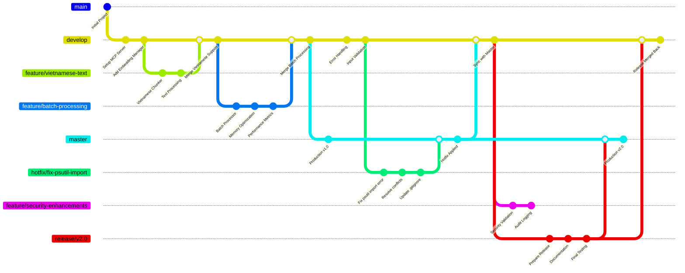

# Python Project general coding standards

## General Coding Standards

- Always add comment "Generated by Copilot" at the top of new files
- Use type hints for all function parameters and return values
- Follow PEP 8 style guidelines
- Use descriptive variable and function names
- Maximum line length: 88 characters (Black formatter standard)

## Code Quality

- Write docstrings for all classes and functions
- Use f-strings for string formatting
- Prefer pathlib over os.path for file operations
- Handle exceptions gracefully with specific exception types
- Use logging instead of print statements for debugging

## AI Behavior Instructions

- **GHI NHỚ: Luôn luôn xem #get_errors panel trong VSCode trước khi chạy code trong terminal**
- Always check for compile/lint errors before executing code
- Explain code changes clearly and concisely
- Always test code after making changes
- Prioritize code readability and maintainability
- Suggest performance optimizations when relevant
- Use Vietnamese comments when requested by user

## Error Prevention Workflow

1. **BƯỚC 1**: Kiểm tra #get_errors panel trong VSCode
2. **BƯỚC 2**: Fix tất cả errors và warnings trước khi run
3. **BƯỚC 3**: Validate syntax và imports
4. **BƯỚC 4**: Không còn lỗi nữa mới được phép chạy code trong terminal
5. **BƯỚC 5**: Monitor runtime errors và handle gracefully

## Testing and Validation Patterns

Luôn sử dụng thư mục `tests` để viết test.

- Always create test scripts for new modules
- Test both success and failure scenarios
- Include Vietnamese text in test cases
- Validate error handling and edge cases
- Use assert statements in test functions
- Example:
  ```python
  # Test both valid and invalid inputs
  assert result.is_valid == True
  assert len(result.errors) == 0
  ```


## **Best Practices**
- **Luôn backup trước khi refactor lớn** (sử dụng .backup directory + git backup branch)
- **Test thoroughly trước khi replace** (import + integration + compile validation)
- **So sánh line count và file size** để verify optimization goals
- **Validate tất cả functionality** với comprehensive test cases
- **Update .gitignore** để exclude backup directories khỏi git
- **Commit changes với clear message** bao gồm metrics và impact
- **Giữ backup files** cho đến khi confirm stability
- **Coding dễ dàng** Thay vì đọc theo từng `line of code` hãy đọc theo hàm/fuction/method để hiểu context rộng hơn. Có bức tranh lớn để giảm lỗi mỗi khi edit file.
- **Hệ thống đa vòng/phản hồi dài hạn** Cho đến khi hết lỗi. Tối ưu chất lượng/performance/giải quyết dứt điểm vấn đề. Không commit code có lỗi.

## Git Branching hiệu quả

- **master**: production

- **develop**: tích hợp các tính năng

- **feature/**: phát triển tính năng

- **release/**: chuẩn bị phát hành

- **hotfix/**: sửa lỗi khẩn cấp
  
Ví dụ mẫu:



## Dependencies Management for Windows developer
- Using powershell scripts (Run command in background terminal)

**Only using `uv` for Python package and project manager.**

## Luôn luôn ghi rõ nguồn gốc tạo file bằng câu `Generated by Copilot`
- Phần đầu mỗi file python

## DO and DO NOT
**DO**

**DO NOT**
- Không tạo file `*.ps1`.