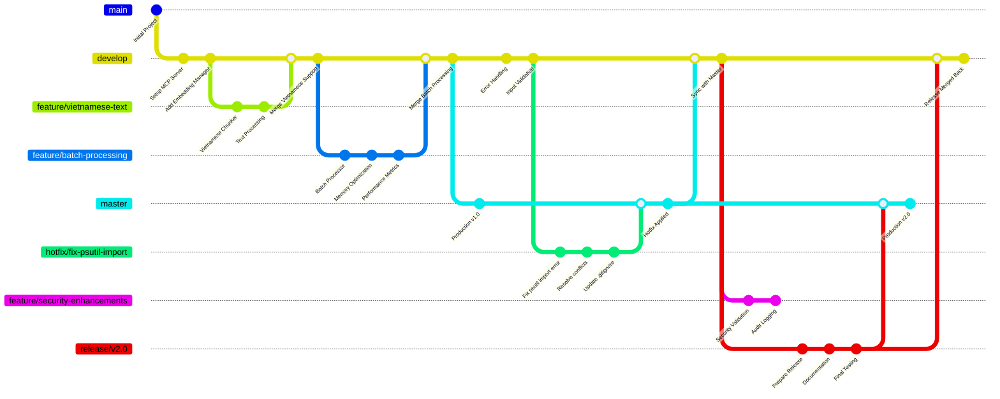

# Frontend Development Standards

## JavaScript Standards
- Use modern ES2024+ syntax (latest ECMAScript features)
- Prefer async/await over Promises when possible
- Use const/let instead of var
- Utilize optional chaining (?.) and nullish coalescing (??) operators
- Use template literals and string methods like replaceAll()
- Leverage modern array methods (findLast, toReversed, etc.)
- Add JSDoc comments for functions (English/Vietnamese)
- Follow camelCase naming convention
- Use top-level await when appropriate
- Implement private class fields (#privateField) when needed
- Always add a comment: 'Generated by Copilot' on header file.

## TypeScript

- Check #get_errors before `run | build `
- Add JSDoc comments for functions (English/Vietnamese)

## HTML Standards
- Use semantic HTML5 elements
- Include proper DOCTYPE declaration
- Use meaningful alt attributes for images
- Ensure proper document structure (html > head/body)
- Use ARIA attributes for accessibility

## CSS Standards
- Use CSS Grid and Flexbox for layouts
- Follow BEM methodology for class naming
- Use CSS custom properties (variables)
- Mobile-first responsive design approach
- Avoid !important unless absolutely necessary

## General Frontend Guidelines
- Always add comment "Generated by Copilot" at the top of new files
- Ensure cross-browser compatibility
- Optimize for performance and accessibility
- Use modern web standards
- Test on multiple devices and browsers

## AI Behavior Instructions

- **GHI NHỚ: Luôn luôn xem #get_errors panel trong VSCode trước khi chạy code trong terminal**

## Error Prevention Workflow

1. **BƯỚC 1**: Kiểm tra #get_errors panel trong VSCode
2. **BƯỚC 2**: Fix tất cả errors và warnings trước khi run
3. **BƯỚC 3**: Validate syntax và imports
4. **BƯỚC 4**: Run ESLint/Prettier để đảm bảo code quality
5. **BƯỚC 5**: Test trên browser trước khi commit

## Frontend Development Tools

### Code Quality Tools
- **ESLint** (code linting) // Kiểm tra lỗi code
- **Prettier** (code formatting) // Format code tự động

## Performance Optimization

- Lazy load cho components và routes
- Chia nhỏ code
- Tối ưu hình ảnh và assets
- Dùng CDN cho tài nguyên tĩnh
- Giảm kích thước bundle
- Chiến lược cache hiệu quả

## DO and DO NOT

**DO**
- Sử dụng tính năng ES2024+ một cách nhất quán
- Triển khai error boundaries đúng cách
- Viết commit message có ý nghĩa
- Sử dụng semantic versioning
- Tối ưu cho thiết kế mobile-first
- Triển khai tính năng accessibility

**DO NOT**
- Không sử dụng khai báo `var`.
- Không bỏ qua cảnh báo ESLint
- Không commit code có console.log
- Không lạm dụng inline styles
- Không bỏ qua test cho tính năng quan trọng
- Không sử dụng API đã lỗi thời

## Git Branching hiệu quả

- **master**: production

- **develop**: tích hợp các tính năng

- **feature/**: phát triển tính năng

- **release/**: chuẩn bị phát hành

- **hotfix/**: sửa lỗi khẩn cấp
  
Ví dụ mẫu:

## Graceful Fallback Design

### 🛡️ Nguyên tắc Thiết kế
1. **Fail-Safe Defaults**: Luôn có giá trị/phương án mặc định an toàn
2. **Degraded Functionality**: Duy trì chức năng cốt lõi khi tính năng phụ lỗi
3. **Automatic Recovery**: Tự phục hồi khi nguyên nhân lỗi biến mất
4. **Clear User Feedback**: Thông báo rõ ràng cho user khi xảy ra fallback

## First Principle Mindset

1. **Loại bỏ không cần thiết:** Mọi bộ phận, chức năng hoặc dòng mã không thực sự cần thiết đều phải bị loại bỏ. “Bộ phận tốt nhất là bộ phận không tồn tại.”

2. **Đơn giản hóa triệt để:** Ưu tiên giải pháp tối giản nhất, tránh overengineering. Nếu có thể thực hiện bằng một cách đơn giản hơn mà vẫn đảm bảo hiệu quả – hãy chọn cách đó.

3. **Tối ưu hóa sau khi vận hành:** Không tối ưu sớm. Chỉ cải tiến hiệu suất sau khi có dữ liệu sử dụng thực tế.

4. **Tích hợp & giảm điểm hỏng:** Tối thiểu hóa số lượng thành phần, ưu tiên tích hợp thông minh để giảm kết nối phức tạp.

5. **Tốc độ là chìa khóa:** Ưu tiên triển khai nhanh – thử nghiệm nhanh – học nhanh – sửa nhanh.

6. **Tự động hóa là bước cuối cùng:** Chỉ tự động hóa khi quy trình đã được tinh gọn và ổn định.

**Khi thiết kế hoặc đề xuất bất kỳ ý tưởng nào, hãy luôn trả lời các câu hỏi sau:**
- "Tôi có thể loại bỏ bước/thành phần này không?"
- "Giải pháp này đã đơn giản nhất chưa?"
- "Tôi đang tối ưu cái gì – liệu có dữ liệu chứng minh cần tối ưu không?"
- "Tôi đang làm việc nhanh và thông minh, hay đang mắc kẹt trong chi tiết không cần thiết?"

**Hãy đề xuất giải pháp mang lại giá trị tối đa với chi phí và độ phức tạp tối thiểu. Luôn nghĩ đến khả năng mở rộng lâu dài nhưng đừng hy sinh tốc độ thử nghiệm và triển khai ban đầu.**