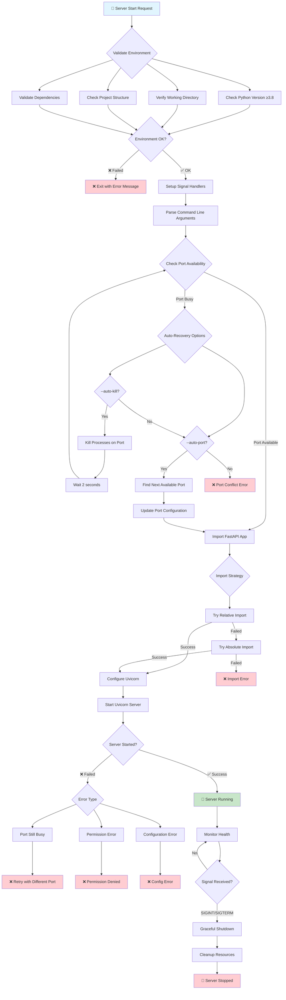
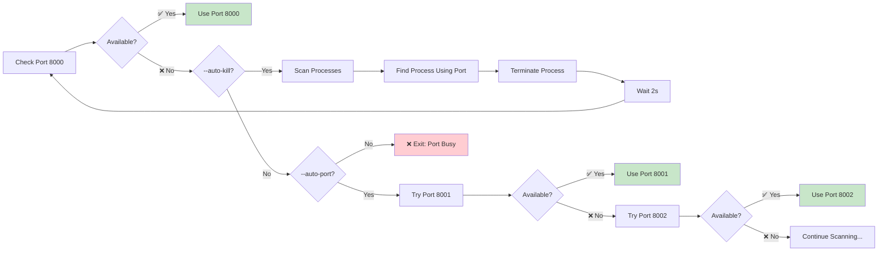
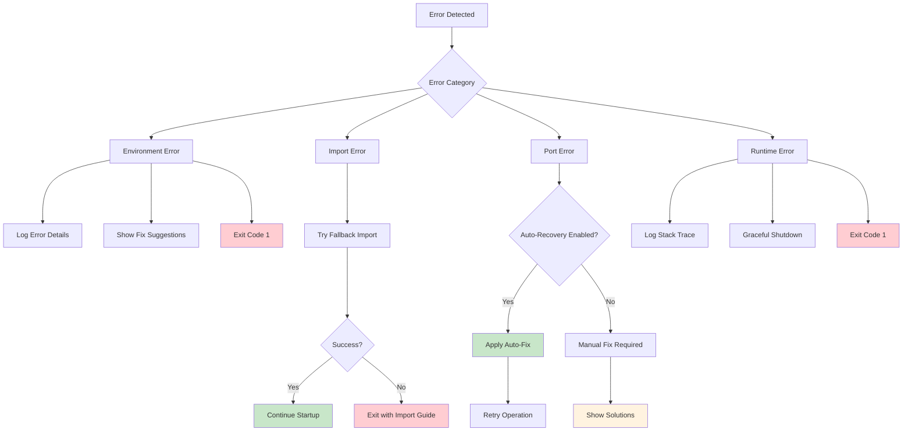
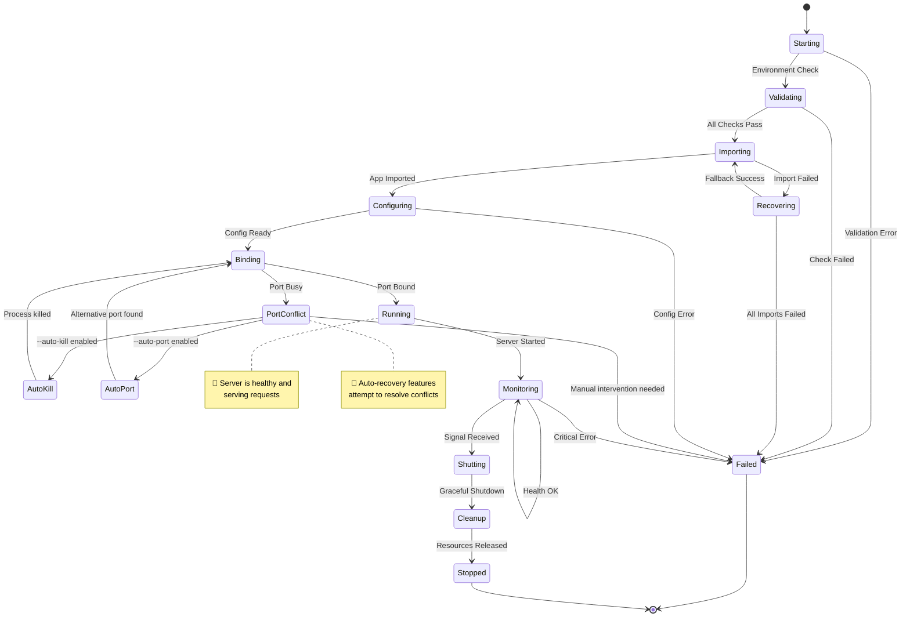
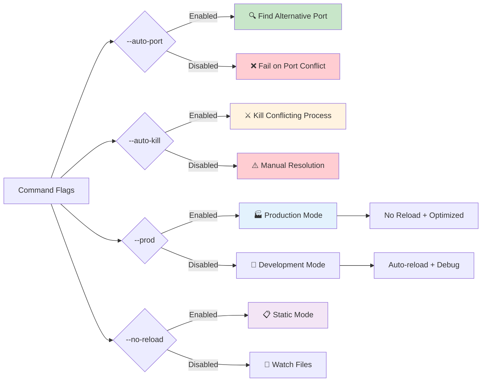

# Generated by Copilot
# PolyMind System Lifecycle - Enhanced Safety Architecture

## 🔄 Server Startup Flow với Safety Improvements



## 🔍 Port Management Flow



## 🛡️ Error Handling Matrix



## 🔄 Application Lifecycle States



## 🚦 Command Line Options Impact



## 📊 Safety Improvements Summary

### ✅ Before vs After

| Aspect | Before | After | Improvement |
|--------|--------|-------|-------------|
| Port Conflicts | ❌ Hard crash | ✅ Auto-recovery | 🔥 **Major** |
| Import Issues | ⚠️ Warnings | ✅ Multiple strategies | 🔥 **Major** |
| Error Messages | ❌ Cryptic | ✅ Clear + solutions | 🔥 **Major** |
| Environment | ❌ No validation | ✅ Comprehensive check | 🆕 **New** |
| Process Mgmt | ❌ Manual | ✅ Automatic | 🆕 **New** |
| Logging | ⚠️ Basic prints | ✅ Structured logging | 🔥 **Major** |
| Signal Handling | ❌ None | ✅ Graceful shutdown | 🆕 **New** |

### 🎯 Key Benefits

1. **🛡️ Reliability**: Server always finds a way to start
2. **🔧 Self-Healing**: Automatic conflict resolution  
3. **📋 Transparency**: Clear logging and error messages
4. **🚀 Developer Experience**: Less manual intervention
5. **🏭 Production Ready**: Robust error handling

### 🔧 Usage Examples

```bash
# Maximum safety - auto-recovery enabled
python -m backend.main --auto-port --auto-kill

# Production mode with port management
python -m backend.main --prod --auto-port

# Development with conflict resolution
python -m backend.main --auto-kill
```

---

*Diagram này minh họa toàn bộ system lifecycle với các cải tiến safety mới được thêm vào PolyMind server.*
