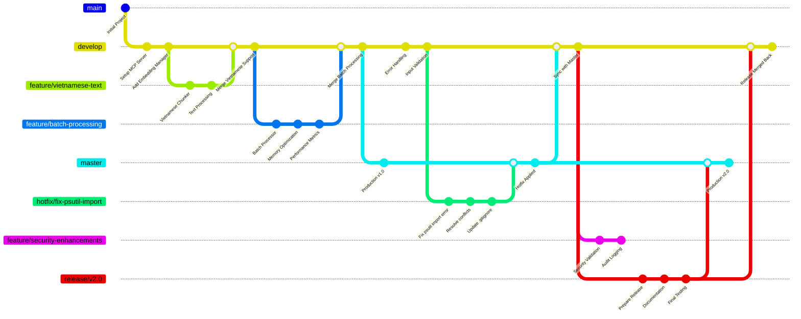

Coding standards, domain knowledge, and preferences that AI should follow.

# Frontend Development Standards

## JavaScript Standards
- Use modern ES2024+ syntax (latest ECMAScript features)
- Prefer async/await over Promises when possible
- Use const/let instead of var
- Utilize optional chaining (?.) and nullish coalescing (??) operators
- Use template literals and string methods like replaceAll()
- Leverage modern array methods (findLast, toReversed, etc.)
- Add JSDoc comments for functions
- Follow camelCase naming convention
- Use top-level await when appropriate
- Implement private class fields (#privateField) when needed

## HTML Standards
- Use semantic HTML5 elements
- Include proper DOCTYPE declaration
- Use meaningful alt attributes for images
- Ensure proper document structure (html > head/body)
- Use ARIA attributes for accessibility

## CSS Standards
- Use CSS Grid and Flexbox for layouts
- Follow BEM methodology for class naming
- Use CSS custom properties (variables)
- Mobile-first responsive design approach
- Avoid !important unless absolutely necessary

## General Frontend Guidelines
- Always add comment "Generated by Copilot" at the top of new files
- Ensure cross-browser compatibility
- Optimize for performance and accessibility
- Use modern web standards
- Test on multiple devices and browsers

## AI Behavior Instructions

- **GHI NHỚ: Luôn luôn xem #get_errors panel trong VSCode trước khi chạy code trong terminal**

## Error Prevention Workflow

1. **BƯỚC 1**: Kiểm tra #get_errors panel trong VSCode
2. **BƯỚC 2**: Fix tất cả errors và warnings trước khi run
3. **BƯỚC 3**: Validate syntax và imports
4. **BƯỚC 4**: Run ESLint/Prettier để đảm bảo code quality
5. **BƯỚC 5**: Test trên browser trước khi commit

## Frontend Development Tools

### Code Quality Tools
- **ESLint** (code linting) // Kiểm tra lỗi code
- **Prettier** (code formatting) // Format code tự động

## Performance Optimization

- Lazy load cho components và routes
- Chia nhỏ code
- Tối ưu hình ảnh và assets
- Dùng CDN cho tài nguyên tĩnh
- Giảm kích thước bundle
- Chiến lược cache hiệu quả

## DO and DO NOT

**DO**
- Sử dụng tính năng ES2024+ một cách nhất quán
- Triển khai error boundaries đúng cách
- Viết commit message có ý nghĩa
- Sử dụng semantic versioning
- Tối ưu cho thiết kế mobile-first
- Triển khai tính năng accessibility

**DO NOT**
- Không sử dụng khai báo `var`.
- Không bỏ qua cảnh báo ESLint
- Không commit code có console.log
- Không lạm dụng inline styles
- Không bỏ qua test cho tính năng quan trọng
- Không sử dụng API đã lỗi thời

## Git Branching hiệu quả

- **master**: production

- **develop**: tích hợp các tính năng

- **feature/**: phát triển tính năng

- **release/**: chuẩn bị phát hành

- **hotfix/**: sửa lỗi khẩn cấp
  
Ví dụ mẫu:

